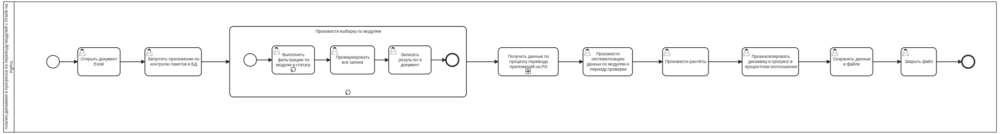

# Описание бизнес-процессов

## Расчёт статистики

На данном бизнес-процессе представлен сбор статитстики по миграции в текущий момент (ASIS):

Все данные по миграции собираются в ручном режиме из разных источников информации.

Ниже представлен бизнес-процесс с автоматизацией операций по сбору и формированию статистики миграции (TOBE):

На схеме представлены следующие бизнес-процессы:

- Анализ динамики и прогресса по переводу модулей
- Аутентификация и авторизация пользователей
- Создание задания с отчётом в Jira
- Настройка модулей
- Сбор общей статистики (Отправка запросов)
- Сбор статистики по серверной части
- Сбор статистики по клиентской части
- Сбор общей статистики (Получение ответов)
