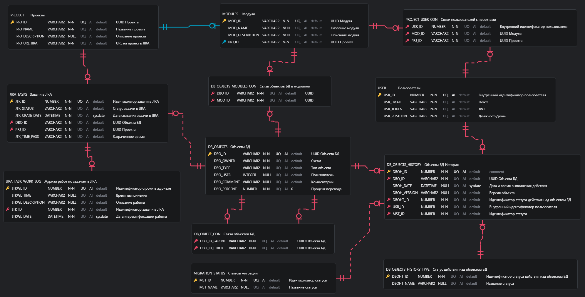

# Информационная модель

## Модель предметной области 

В рамках MVP проекта были выделены основные сущности с атрибутами и определены связи между ними.

Базовыми сущностями являются:

- Проект
- Модуль
- Функциональная часть
- Элементы серверной части
- История по элементам серверной части
- Элементы клиентской части
- История по элементам клиентской части
- Расширенная история по элементам клиентской части
- Пользователь
- Задачи в Jira
- Журнал работ по задачам в Jira

```uml
@startuml

Entity Проект{
Код проекта
Название проекта
Описание проекта
}

Entity Модуль{
Код проекта
Код модуля
Название модуля
Описание модуля
Элементы серверной части
Элементы клиентской части
Список привязанных пользователей
}

Entity Функциональная_часть{
Код функциональной части
Код модуля
Название функциональной части
Описание функциональной части
Элементы серверной части
Элементы клиентской части
}

Entity Элементы_Серверной_Части{
Код объекта
Название объекта
Схема расположения
Тип объекта
Трудоёмкость
Задача
Список элементов, от которых зависит текущий
Список элементов, которые зависят от текущего
}

Entity История_по_элементам_Серверной_Части{
Дата обновления объекта
Код пользователя
Версия элемента
Тип действия над элементом
Статус
Получить последнюю дату обновления элемента(Код элемента)
Получить последнюю версию элемента(Код элемента)
Получить дату создания элемента(Код элемента)
Получить последнего разработчика элемента(Код элемента)
Получить последнего тестировщика элемента(Код элемента)
Получить последний статус элемента(Код элемента)
Прогресс выполнения
}

Entity Задачи{
Код продукта
Код модуля
Код функциональной части
Код задачи
Исполнитель
Заказчик
Статус
}

Entity Задачи_в_JIRA{
Код задачи
Статус задачи
Дата создания задачи
Код проекта
}

Entity Журнал_работ_по_задачам_в_JIRA{
Код строки журнала
Время выполнения задачи
Описание работы
Код задачи
Дата фиксации строки в журнале
}

Entity Связь_задачи_с_частями{
Код задачи
Список элементов серверной части
Список элементов клиентской части
}

Entity История_по_элементам_Клиентской_Части{
Название модуля
Процент перевода
Количество функций на Оракле
Количество функций на ПГ
}

Entity Расширенная_история_по_элементам_Клиентской_Части{
Название пакета
Расположение пакета
Процент перевода пакета
Количество функций пакета на Оракле
Количество функций пакета на ПГ
}

Entity Элементы_Клиентской_Части{
Название JAR
Тип файла
Дата изменения файла
Расположение на FTP
Расположение на SVN
}

Entity Пользователь{
Код пользователя
Логин
Пароль
Тип пользователя
}

Пользователь "1 " -.-> "1..n  " Модуль
Проект "1  " -.-> "1..n  " Модуль
Модуль "1 " -.-> "1..n  " Функциональная_часть
Модуль "1    " --o "1..n      " Элементы_Серверной_Части
Функциональная_часть "1   " --o "1..n  " Элементы_Серверной_Части
Модуль "1" --o "1..n        " Элементы_Клиентской_Части
Элементы_Клиентской_Части "1 " --o "1..n " История_по_элементам_Клиентской_Части
История_по_элементам_Клиентской_Части "1 " --o "1..n " Расширенная_история_по_элементам_Клиентской_Части
Элементы_Серверной_Части "1 " --o "1..n " История_по_элементам_Серверной_Части

Задачи "1 " --> "1..n " Связь_задачи_с_частями
Задачи "1" --> "1" Задачи_в_JIRA
Задачи_в_JIRA "1" --> "1..n" Журнал_работ_по_задачам_в_JIRA
Связь_задачи_с_частями "1 " --> "        1..n" Элементы_Серверной_Части
Связь_задачи_с_частями "1" --> "1..n   " Элементы_Клиентской_Части
@enduml
```

## Модель данных сервиса расчёта статистики по процессу миграции


## Модель данных сервиса получения данных по процессу миграции объектов БД



## Модель данных сервиса получения данных по процессу миграции Jar

