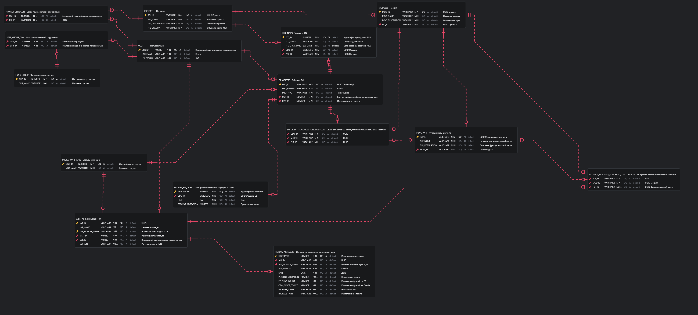

# Информационная модель

## Модель предметной области для сервиса расчёта статистики по процессу миграции 

В рамках MVP проекта были выделены основные сущности с атрибутами и определены связи между ними.

Базовыми сущностями являются:

- Проект
- Модуль
- Функциональная часть
- Элементы серверной части
- История по элементам серверной части
- Элементы клиентской части
- История по элементам клиентской части
- Расширенная история по элементам клиентской части
- Пользователь

## Модель данных сервиса расчёта статистики по процессу миграции

## Модель предметной области для сервиса получения данных по процессу миграции объектов БД

В рамках MVP проекта были выделены основные сущности с атрибутами и определены связи между ними.

Базовыми сущностями являются:

- Проект
- Модуль
- Функциональная часть
- Объекты БД
- Объекты БД История
- Задачи в Jira
- Журнал работ по задачам в Jira
- Пользователь

## Модель данных сервиса получения данных по процессу миграции объектов БД

## Модель предметной области для сервиса получения данных по процессу миграции Jar

В рамках MVP проекта были выделены основные сущности с атрибутами и определены связи между ними.

Базовыми сущностями являются:

- Проект
- Модуль
- Функциональная часть
- Объекты БД
- Объекты БД История
- Задачи в Jira
- Журнал работ по задачам в Jira
- Пользователь

## Модель данных сервиса получения данных по процессу миграции Jar

