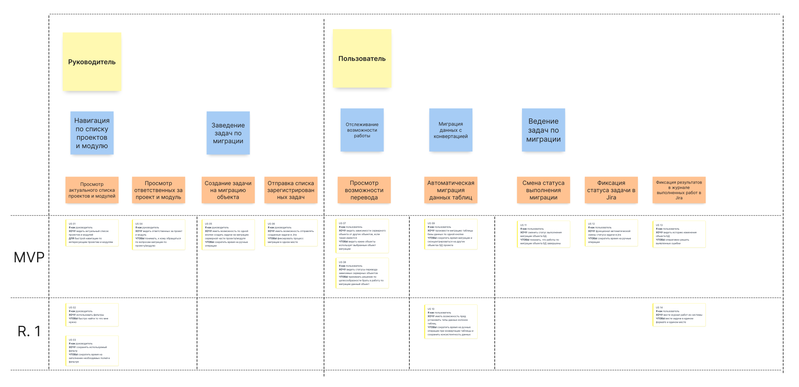

# User Story диаграммы

Система состоит из четырёх сервисов:
 - Сервис аутентификации и авторизации
 - Сервис расчёта статистики по процессу миграции
 - Сервис получения данных по процессу миграции объектов БД
 - Сервис получения данных по процессу миграции Jar

Основные функции системы представлены в виде User Story диаграмм.

## **`USSCMS`** User Story по сервису расчёта статистики миграции

## **`USSDTODB`** User Story по сервису получения данных по процессу миграции объектов БД

## **`USSDTA`** User Story по сервису получения данных по процессу миграции Jar

